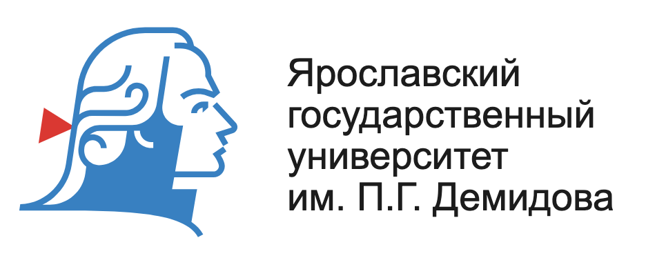
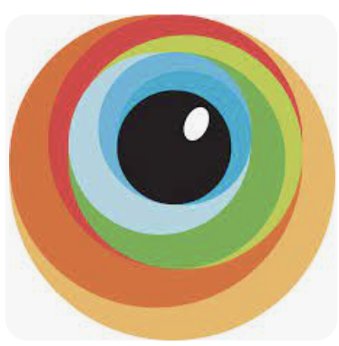

### Привет!👋

Обо мне:
- Меня зовут Полина
- Я инженер по тестированию программного обеспечения 
- Учусь писать автотесты на Python и очень хочу развиваться в автотестировании
- Мои контакты:

  &#8287;&#8287;&#8287;&#8287;&#8287;
    
    
    

#### Образование
<table width="100%" border='0'>
   <tr> 
    <td width="30%" valign="bottom"></td><td valign="middle">ЯрГУ им. П.Г.Демидова Математический факультет.</td></tr>
  </table>

#### Дополнительное образование
<table width="100%" border='0'>
   <tr> 
    <td width="30%" valign="bottom"></td><td valign="middle">Курс по автоматизации на Python.</td></tr>
  </table>

#### Stack and tools

  <code></code>
  <code></code>
  <code></code>
  <code></code>
  <!-- <code></code> -->
  <!-- <code></code> -->
  <code></code>
  <code></code>
  <code></code>
  <code></code>
  <code></code>
  <!-- <code></code> -->
  <!-- <code></code> --> 
  <code></code>
  <code></code>
  <code></code>
  <!-- <code></code> -->
  <!-- <code></code> -->
  <code></code>
  <code></code>
  <!-- <code></code> -->
 

### My stat

    
    
    
    

---